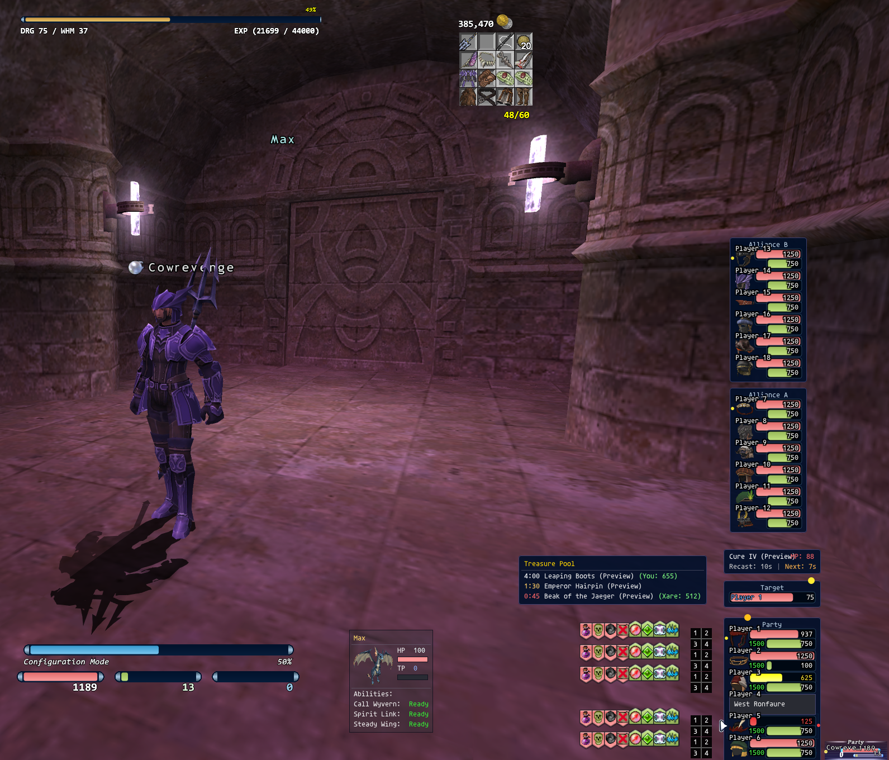
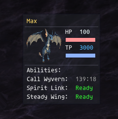

# CowXIUI

**Updated HXUI for HorizonXI.** A forked, actively-maintained build of [tirem/HXUI](https://github.com/tirem/HXUI) tuned for the **HorizonXI** private server (75-cap, era-accurate content), with a heavy focus on Beastmaster / Dragoon / Summoner quality-of-life, a modern visual refresh, and a pile of UX improvements layered on top of the stock feature set.

Everything the original HXUI shipped still works. The config menu picks up new sections automatically and your existing settings persist across updates.



---

## What's New

### Fixed

- **Dispel bug** — the effect is now actually removed from the mob's status when the spell is cast.
- **Target bar name truncation** — long mob names ellipsis-clean instead of overlapping the HP percent.
- **Party list leader / sync dot colors and positions** — yellow Leader sits to the *left* of the job icon, red Sync sits to the *right*, matching the in-game UI semantics.

### Added

- **Stacked HP/MP option** for denser player/target bars.
- **Modern Style** — clean dark-blue panel look, switchable in the General section. Affects party list, alliance lists, target preview, and cast cost window together.
- **Treasure Pool window** with live item tracking.
- **Cast Box** — floating info panel above the target showing spell / ability / weapon-skill MP cost, recast, and TP requirements. Has its own Modern theme toggle separate from the global one.
- **Cure buttons on party list** (off by default).
- **Fixed-anchor target window** in the party menu — the Target preview snaps to Party 1 so it stops wandering when the party list scales.
- **Target bar options** — Show Enemy ID, Always Show Health Percent (including friendly / neutral targets).
- **Party status dot system:**
  - Gold Treasure / Cyan Trade dots above Player 1 at the 25% / 75% marks.
  - Yellow Leader / Red Sync dots beside each member's job icon.
  - All dots render correctly in both the textured and Modern themes.



- **Pet HUD** — a comprehensive floating HUD for **BST / DRG / SMN**:
  - HP / TP / MP tracking and the BST Ready-charge counter.
  - Pet portrait images for jug pets, wyverns, all 14 avatars, and spirits.
  - Pet buff / debuff panel (Stoneskin, Regen, Haste, etc. visible on your pet).
  - Charm duration timer using the PetMe formula with a full 16-slot gear scan and the Familiar +25 min extension.
  - Jug duration timer backed by an HzXI-accurate pet database (27 pets sourced from the HzXI wiki).
  - BST ready-moves list with damage-type icons.
  - Ability recasts tracked for Reward, Call Beast, Call Wyvern, Spirit Link, Steady Wing, Deep Breathing, Apogee, Mana Cede, and Astral Flow.
  - **Clickable** — any ability or ready-move row fires the matching `/ja` or `/pet` command. No macros required.
  - **Click-to-summon** when no pet is out: "Call Wyvern" on DRG, "Call Beast" on BST.
  - **Per-avatar SMN Blood Pact favorites** — nested config menu with all 14 avatars, each with Rage and Ward inputs.

### Modded

- Removed blue dots from the inventory count for a cleaner look.
- Shift+click slightly to the right of the text numbers to move the inventory tracker.
- **Enhanced Debuffs** — click a party member's debuff icon to auto-cast the matching White Magic cure (Paralyna / Silena / Stona, etc.).
- **Enhanced Targeting** — click alliance or party member names to target them directly.
- Party list Shift+hold-drag to move the window (plain click still targets the member under the cursor).
- Click-to-target hit area extended to cover the job icon, not just the HP/MP bars.
- Compact Mode 1 / Mode 2 — choose whether buffs and debuffs share one line or split onto two.

### Known Todo

- **Anchored target bar (party menu) is unfinished:** no locked-position support yet, treasure / status icons don't render on it, and NPC status isn't read correctly. Working on it.

---

## Core Elements (inherited from HXUI)

- Player Bar
- Target Bar (w/ Target of Target and Buffs & Debuffs)
- Party List (w/ Buffs & Debuffs)
- Enemy List (w/ Buffs & Debuffs)
- Cast Bar
- Exp Bar
- Inventory Tracker
- Gil Tracker
- Full configuration UI covering every element

---

## Installation

1. Download the latest build:
   [cowrevenge/CowXIUI (main .zip)](https://github.com/cowrevenge/CowXIUI/archive/refs/heads/main.zip)
2. Extract the `.zip`. You'll get a directory called `CowXIUI-main` containing the addon files.
3. Rename that directory to `HXUI` (the addon still registers internally as `hxui`, so the folder name must match).
4. Copy the `HXUI` folder into your Ashita addons directory: `HorizonXI\Game\addons`.
5. **Recommended:** make the addon auto-load every session.
   - Open `HorizonXI\Game\scripts\default.txt`.
   - Find the "Plugin and Addon Configurations" section.
   - After the `/wait 3` line and below the `=======` block, add:
     ```
     /addon load hxui
     ```
   - Save the file.
6. To manually load in-game: `/addon load hxui`
7. To open the configuration menu: `/hxui`

---

## Updating Notes

1. **From ConsolidatedUI or upstream HXUI:** your existing config in `game/config/addons/hxui` is compatible. Old settings persist, new settings inherit defaults.
2. **Before installing a new release**, delete the old `HXUI` folder in `game/addons` first — asset directories can change between versions and leftover files sometimes collide. Your settings in `game/config/addons/hxui` are *not* touched by this; they persist across updates.
3. Patch notes display automatically in-game on the first load after an update, via the built-in Patch Notes window.

---

## Credits & License

- Upstream project: [tirem/HXUI](https://github.com/tirem/HXUI) — the foundational addon this fork is built on. Massive thanks to the original authors.
- HorizonXI-specific enhancements, the Pet HUD module, Modern theme, Cast Box, and the QoL modifications are original to this fork.
- Jug pet data sourced from the [HorizonXI wiki](https://horizonffxi.wiki/Category:Familiars).
- Licensed under **GPL-3.0**, matching upstream.

## Issues & Contributions

Bug reports and feature requests specific to this fork belong in the [CowXIUI issue tracker](https://github.com/cowrevenge/CowXIUI/issues) — please don't file them upstream against tirem/HXUI, as the original maintainers aren't responsible for fork behavior. PRs welcome.